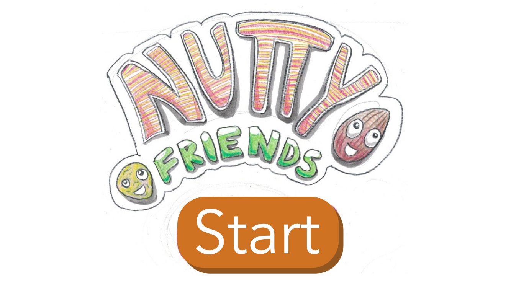

# Nutty Friends!

A story-based augmented reality game created to increase awareness of and consumption of nuts amongst young people.

## Video

## Technology

Created in Unity with C#.
Vuforia was used as the augmented reality framework.

## Capstone Project

### Interaction Design Studio

- Alexander Desmond - Software Developer
- ... - UI Designer
- ... - Story and Visual Designer
